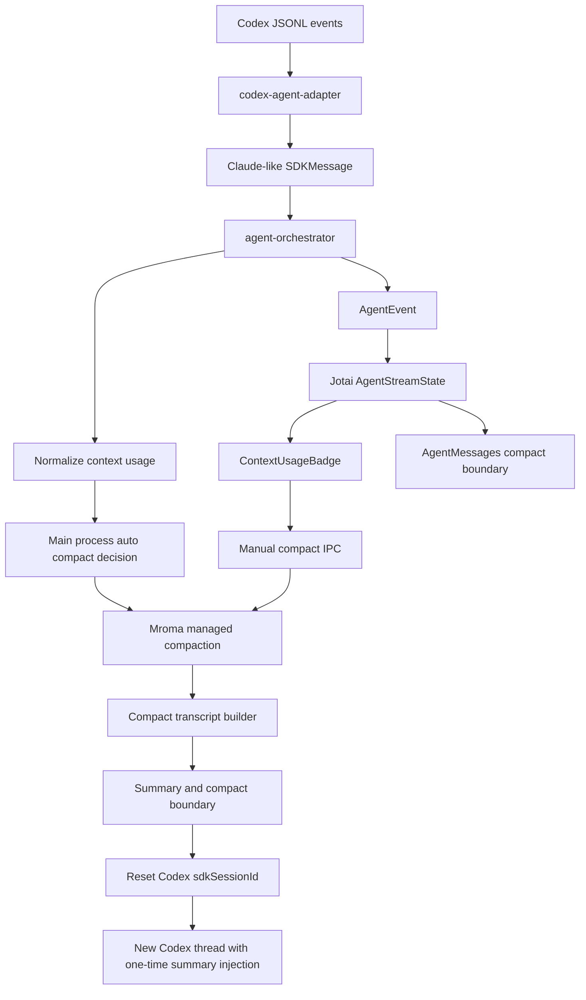

# Codex Agent SDK 兼容、上下文展示与托管式压缩计划

## 一、核心结论

当前 Mroma 的 Codex 集成方向是正确的：继续使用官方 `@openai/codex-sdk` 作为底层通信层，同时在 Mroma 内部维护自己的 `CodexAgentAdapter`，把 Codex 事件转换为 Mroma 统一的 Agent 消息和 UI 状态。

不建议 fork 或长期直接依赖 `/home/yfdl/project/codex/sdk/typescript` 源码。该本地 SDK 包版本为 `0.0.0-dev`，入口依赖 `dist/`，且默认需要解析 `@openai/codex` 及平台 native binary。更稳妥的路线是继续使用官方发布包，并在 Mroma adapter 层做兼容、容错、上下文估算和托管式压缩。

关键研究结论：

- `/home/yfdl/project/codex/docs` 本地文档主要是外链索引，没有提供 TypeScript SDK、context window、auto compact 的完整规范。
- `/home/yfdl/project/codex/sdk/typescript` 当前公开 API 是 `Codex -> Thread -> run/runStreamed`。
- Codex TypeScript SDK 公开事件主要包括 `thread.started`、`turn.started`、`item.started`、`item.updated`、`item.completed`、`turn.completed`、`turn.failed`、`error`。
- `Usage` 仅包含 `input_tokens`、`cached_input_tokens`、`output_tokens`、`reasoning_output_tokens`，没有 `total_tokens`、`context_window`、`remaining_context`、compact event 或 compact API。
- Codex SDK 默认会解析 `@openai/codex` 及平台 optional binary；如果 Mroma 仍希望支持用户全局安装的 `codex`，需要显式实现 `codexPathOverride` fallback。
- Codex 自动压缩不能依赖 SDK 原生能力。可行方案是 Mroma 托管式压缩：生成摘要、记录压缩边界、重置 Codex thread，并在后续新 thread 的首轮提示词中注入摘要。

## 二、目标架构



架构原则：

1. Codex SDK 只作为底层通信层。
2. Mroma Adapter 负责兼容、容错、事件转换和上下文语义。
3. 自动压缩决策放在主进程，不能依赖 UI 组件是否挂载。
4. Codex TypeScript SDK 当前没有原生 compact API，因此采用 Mroma 托管式压缩。
5. 压缩成功后重置 Codex thread，下一轮只注入一次摘要，避免上下文重复膨胀。

## 三、分阶段计划

### 阶段 1：加固 Codex SDK 依赖与 Electron 打包

涉及文件：

- `/home/yfdl/project/Mroma/apps/electron/package.json`
- `/home/yfdl/project/Mroma/apps/electron/electron-builder.yml`
- `/home/yfdl/project/Mroma/apps/electron/src/main/lib/adapters/codex-agent-adapter.ts`
- 可能新增：`/home/yfdl/project/Mroma/apps/electron/src/main/lib/codex-cli-resolver.ts`

具体动作：

1. 将 Codex SDK 版本从 `^0.133.0` 改为精确版本 `0.133.0`，避免 SDK 自动升级导致事件 schema、binary 分发方式或 CLI 参数变化。
2. 确认是否需要显式声明 `@openai/codex` 依赖，版本与当前 SDK 匹配。
3. 保留并校验 `electron-builder.yml` 中的 `asarUnpack` 与 `files` 配置，确保 `@openai/codex-sdk`、`@openai/codex` 和平台 binary 都被打入安装包。
4. 明确 Codex CLI 来源优先级：
   - 优先使用 SDK 默认解析的 `node_modules/@openai/codex` 平台 binary。
   - 如果包内 binary 缺失，fallback 到 `PATH` 中的全局 `codex`。
   - 如果都失败，返回明确错误提示。

### 阶段 2：加固 Codex Adapter 错误边界和 binary fallback

涉及文件：

- `/home/yfdl/project/Mroma/apps/electron/src/main/lib/adapters/codex-agent-adapter.ts`
- 可能新增：`/home/yfdl/project/Mroma/apps/electron/src/main/lib/codex-cli-resolver.ts`
- `/home/yfdl/project/Mroma/apps/electron/src/main/lib/adapters/codex-agent-adapter.test.ts`

具体动作：

1. 把 adapter 顶部注释从“用户必须全局安装 codex CLI”调整为真实策略：Mroma 优先使用随 `@openai/codex` 包安装的 native binary；如果包内 binary 不存在，再 fallback 到用户 `PATH` 中的 `codex`。
2. 拆分错误边界：
   - `import('@openai/codex-sdk')` 失败：提示应用依赖不完整。
   - `new CodexCtor(...)` 失败：提示 Codex CLI binary 缺失，并尝试 PATH fallback。
   - `thread.runStreamed(...)` 失败：按 API key、baseUrl、Responses API、sandbox、cwd、resume、网络等原因分类提示。
3. 新增 `codexPathOverride` fallback：首次按 SDK 默认路径创建失败且错误像 binary 缺失时，扫描 `PATH` 中的 `codex` 或 `codex.exe`，然后用 `new Codex({ codexPathOverride, ... })` 重试。
4. 保持 `env` 完整传递，避免 Codex SDK 的 `env` 替换语义导致 `PATH`、`HOME`、`SHELL`、proxy、Git、证书等变量丢失。
5. `baseUrl` 以 SDK 参数为主，环境变量 `OPENAI_BASE_URL` 只作为兼容补充。

### 阶段 3：类型化 Codex 流式 metadata

涉及文件：

- `/home/yfdl/project/Mroma/packages/shared/src/types/agent.ts`
- `/home/yfdl/project/Mroma/apps/electron/src/main/lib/adapters/codex-agent-adapter.ts`
- `/home/yfdl/project/Mroma/apps/electron/src/renderer/hooks/useGlobalAgentListeners.ts`
- 相关 reducer / apply event 文件

当前 adapter 使用非类型化字段：

```ts
_codexStreamingKey
_codexTransient
```

建议迁移为统一 metadata：

```ts
interface SDKMessageMetadata {
  backend?: 'claude' | 'codex'
  streamingKey?: string
  transient?: boolean
  itemStatus?: 'started' | 'updated' | 'completed' | 'failed'
  sourceEvent?: string
}
```

行为要求：

1. `item.started` 生成 transient message。
2. `item.updated` 按 `streamingKey` 替换已有 transient。
3. `item.completed` 写入最终 message，并移除对应 transient。
4. transient message 不写入长期 JSONL。
5. 未知 Codex item 保留 fallback system message，不导致 stream 崩溃。

### 阶段 4：统一上下文用量模型

涉及文件：

- `/home/yfdl/project/Mroma/packages/shared/src/types/agent.ts`
- `/home/yfdl/project/Mroma/apps/electron/src/renderer/atoms/agent-atoms.ts`
- `/home/yfdl/project/Mroma/apps/electron/src/renderer/components/agent/ContextUsageBadge.tsx`
- `/home/yfdl/project/Mroma/apps/electron/src/renderer/atoms/agent-context-usage.test.ts`

建议新增或规范类型：

```ts
interface AgentContextUsage {
  backend: 'claude' | 'codex'
  source: 'sdk' | 'estimated' | 'configured' | 'fallback'
  scope: 'turn' | 'active_context' | 'session'
  inputTokens: number
  cachedInputTokens: number
  outputTokens: number
  reasoningTokens: number
  estimatedActiveTokens: number
  contextWindow?: number
  usedPercent?: number
  model?: string
  updatedAt: string
}
```

Codex usage 规则：

- Codex `input_tokens` 已包含 `cached_input_tokens`。
- 计算展示时必须避免 cached token 双算。
- `estimatedActiveTokens = input_tokens + output_tokens + reasoning_output_tokens`。
- 如果继续复用现有 Mroma `usage.input_tokens + cache_read_input_tokens` 逻辑，则 adapter 内部继续保持 `input_tokens = input_tokens - cached_input_tokens`、`cache_read_input_tokens = cached_input_tokens`。

展示语义：

- Codex 场景必须标记为“估算”。
- 不应把 Codex turn-level usage 显示成 SDK 精确上下文。

contextWindow 优先级：

1. 模型高级配置中的 `contextWindow`。
2. 模型名 fallback。
3. 未知时不显示百分比，只显示 token 数。

### 阶段 5：上下文用量恢复与持久化

涉及文件：

- `/home/yfdl/project/Mroma/apps/electron/src/main/lib/agent-session-manager.ts`
- `/home/yfdl/project/Mroma/apps/electron/src/renderer/atoms/agent-atoms.ts`
- `/home/yfdl/project/Mroma/apps/electron/src/renderer/hooks/useGlobalAgentListeners.ts`

具体动作：

1. 应用重启或切换会话后，从最新的 `result` message 恢复 context usage。
2. 如果没有 usage，`ContextUsageBadge` 显示“暂无用量”。
3. compact 成功后，usage 状态重置为“已压缩，等待下一轮更新”。
4. 不要把 Codex turn-level usage 累加成 session total，除非字段名明确是 cumulative estimate。

### 阶段 6：实现 Mroma 托管式上下文压缩协议

涉及文件：

- `/home/yfdl/project/Mroma/apps/electron/src/main/lib/agent-orchestrator.ts`
- `/home/yfdl/project/Mroma/apps/electron/src/main/lib/agent-session-manager.ts`
- `/home/yfdl/project/Mroma/apps/electron/src/main/ipc.ts`
- `/home/yfdl/project/Mroma/apps/electron/src/preload/index.ts`
- `/home/yfdl/project/Mroma/packages/shared/src/types/agent.ts`

新增 IPC：

```ts
compactContext(sessionId: string, reason: 'manual' | 'auto' | 'prompt_too_long')
cancelCompact(sessionId: string)
```

建议新增 compact 状态：

```ts
compactInFlight?: boolean
lastCompactAt?: string
lastCompactSummary?: string
lastCompactReason?: 'manual' | 'auto' | 'prompt_too_long'
lastCompactSourceSdkSessionId?: string
pendingCompactSummary?: string
compactSummaryInjectedSdkSessionId?: string
compactError?: string
```

Codex 压缩策略：

1. 当前 session 加锁，禁止 sendMessage 并发进入。
2. 设置 `compactInFlight`。
3. 从 Mroma JSONL 构建压缩 transcript。
4. 使用同一渠道生成 summary。
5. 保存 compact marker 和 summary。
6. 清空当前 session 的 Codex `sdkSessionId`。
7. 下一轮发送时 `startThread`。
8. 仅在新 thread 第一轮注入 compact summary。
9. 收到 `thread.started` 后记录新的 `sdkSessionId`。
10. 标记 summary 已注入，后续 resume 不重复注入。

失败回滚：

1. compact 失败时，不清空旧 `sdkSessionId`。
2. compact 失败时，旧 Codex thread 仍然可用。
3. UI 显示失败原因和重试入口。
4. 用户取消 compact 时恢复原状态。

### 阶段 7：压缩 transcript builder

涉及文件：

- 可能新增：`/home/yfdl/project/Mroma/apps/electron/src/main/lib/agent-compact-transcript-builder.ts`
- `/home/yfdl/project/Mroma/apps/electron/src/main/lib/agent-session-manager.ts`

目标：把完整 JSONL 历史转成适合摘要的 transcript，避免直接把巨大历史塞进模型。

构建规则：

1. 用户消息尽量完整保留。
2. assistant 文本保留。
3. thinking 默认不全量保留，只保留简短摘要或跳过。
4. Bash 输出截断，只保留命令、退出码、关键输出。
5. file_change 只保留文件路径、变更类型、摘要。
6. MCP result 限制长度。
7. 附件内容不全量塞入摘要。
8. transient message 不进入压缩 transcript。
9. compact marker 之后的历史单独处理，避免重复摘要。

分块摘要：

```txt
history chunks
  -> chunk summaries
    -> final summary
```

最低实现可以先按字符数或近似 token 分块。

### 阶段 8：压缩摘要格式

压缩摘要应使用稳定结构，方便后续注入新 thread。

建议模板：

```md
## 当前任务目标

## 用户偏好和约束

## 已完成操作

## 修改过的文件

## 关键决策

## 当前状态

## 待办事项

## 风险和注意事项

## 后续必须携带的上下文
```

如果 Codex SDK `outputSchema` 在压缩场景稳定，也可以使用 JSON schema 输出，再渲染为 Markdown summary。

### 阶段 9：主进程自动压缩判定与防抖

涉及文件：

- `/home/yfdl/project/Mroma/apps/electron/src/main/lib/agent-orchestrator.ts`
- `/home/yfdl/project/Mroma/apps/electron/src/renderer/lib/agent-auto-compact.ts`
- `/home/yfdl/project/Mroma/apps/electron/src/renderer/lib/agent-auto-compact.test.ts`
- `/home/yfdl/project/Mroma/packages/shared/src/types/channel.ts`

自动压缩决策建议放主进程：

```txt
turn.completed
  -> orchestrator 更新 context usage
  -> orchestrator 判断 auto compact
  -> compact service 执行
  -> renderer 只负责展示状态
```

触发条件：

```txt
autoCompact enabled
AND contextWindow 有效
AND usedPercent >= threshold
AND 当前 session 没有正在 sendMessage
AND 当前 session 没有 compactInFlight
AND 本轮没有触发过 compact
AND 距离上次 compact 超过最小间隔
```

默认阈值建议为 85%。Codex 因为是估算 usage，可以更保守。

防抖策略：

1. `compactInFlight` 时不重复触发。
2. `lastAutoCompactTriggerTurnId` 防止同一轮重复触发。
3. `lastCompactAt` 防止短时间连续触发。
4. compact 失败后不要无限重试。

### 阶段 10：手动压缩与 UI 展示

涉及文件：

- `/home/yfdl/project/Mroma/apps/electron/src/renderer/components/agent/ContextUsageBadge.tsx`
- `/home/yfdl/project/Mroma/apps/electron/src/renderer/components/agent/AgentHeader.tsx`
- `/home/yfdl/project/Mroma/apps/electron/src/renderer/components/agent/AgentMessages.tsx`
- `/home/yfdl/project/Mroma/apps/electron/src/renderer/components/agent/SDKMessageRenderer.tsx`

UI 行为：

1. `ContextUsageBadge` 显示已用 / 总上下文、剩余百分比、数据来源、是否启用自动压缩、`compactInFlight` 状态。
2. 增加“压缩上下文”手动按钮。
3. 禁用条件包括正在发送消息、正在 compact、没有足够历史、当前 provider 不支持托管式 compact。
4. 消息流中渲染 compact boundary：旧历史已摘要并用于后续模型上下文，完整记录仍保留在界面中。
5. 显示可折叠 compact summary 卡片。

### 阶段 11：fork / resume / compact 关系

涉及文件：

- `/home/yfdl/project/Mroma/apps/electron/src/main/lib/agent-session-manager.ts`
- `/home/yfdl/project/Mroma/apps/electron/src/main/lib/agent-orchestrator.ts`

规则：

1. compact 成功后，旧 `sdkSessionId` 保存到 `lastCompactSourceSdkSessionId`。
2. 当前 session 的 `sdkSessionId` 清空，下一轮创建新 Codex thread。
3. `pendingCompactSummary` 只在新 thread 第一轮注入。
4. 收到新 `thread.started` 后，设置 `compactSummaryInjectedSdkSessionId = newSdkSessionId`，并清空 `pendingCompactSummary`。
5. 后续 resume 这个新 thread 时，不重复注入 summary。
6. fork 一个已压缩 session 时，需要继承 compact summary 状态，但不能错误复用旧 thread。
7. resume 到压缩前某条消息时，需要决定是否清除后续 compact marker。
8. compact 失败不改变原 `sdkSessionId`。

### 阶段 12：Codex 配置隔离风险评估

涉及文件：

- `/home/yfdl/project/Mroma/apps/electron/src/main/lib/adapters/codex-agent-adapter.ts`
- 可能涉及 config path 服务

目标：确认 Codex CLI 是否会读取用户全局配置，例如 `~/.codex`，以及是否支持独立配置目录或环境变量隔离。

风险：

- 用户 CLI 配置影响 Mroma。
- Mroma baseUrl / approval / sandbox 被全局配置干扰。
- hooks 带来安全边界问题。
- Mroma 会话和用户 CLI 会话混杂。

第一版建议：如果短期不做隔离，至少在错误提示或文档说明 Codex 可能读取用户 Codex 全局配置。后续再评估是否给 Mroma 独立 Codex home/config。

### 阶段 13：能力矩阵与 UI 降级

涉及文件：

- `/home/yfdl/project/Mroma/apps/electron/src/renderer/components/settings/ChannelForm.tsx`
- `/home/yfdl/project/Mroma/apps/electron/src/renderer/components/agent/AgentHeader.tsx`
- `/home/yfdl/project/Mroma/apps/electron/src/main/lib/agent-prompt-builder.ts`

建议维护能力矩阵：

| 能力 | Claude 后端 | Codex 后端 |
| --- | --- | --- |
| SDK 级工具权限拦截 | 支持 | 当前不支持 |
| Mroma PermissionBanner | 支持 | 不完全支持 |
| MCP 注入 | 支持 | 需要额外确认 |
| Skills | 支持 | 需要提示词/配置适配 |
| 图片输入 | 支持 | 当前 adapter 已支持 |
| structured output | 支持路径不同 | Codex outputSchema 支持 |
| 原生 compact | Claude 路径可扩展 | Codex TS SDK 当前无公开 API |
| Mroma 托管式 compact | 可做 | 可做 |
| context usage | 较接近 SDK | Codex 为估算 |

UI 提示建议：

```txt
Codex Agent 使用 Responses API。部分权限确认、MCP 和上下文用量为兼容实现，与 Claude 后端存在差异。
```

### 阶段 14：错误分类和用户提示

涉及文件：

- `/home/yfdl/project/Mroma/apps/electron/src/main/lib/adapters/codex-agent-adapter.ts`
- 可能新增错误工具函数

需要区分的错误：

1. SDK 包缺失。
2. Codex CLI binary 缺失。
3. API Key 缺失。
4. API Key 无效。
5. baseUrl 不是 Responses API。
6. Chat Completions endpoint 被误用于 `openai-responses`。
7. sandbox 权限失败。
8. workingDirectory 不存在。
9. thread resume 失败。
10. compact summary 生成失败。
11. 用户主动取消。

特别提示：如果用户把 Chat Completions endpoint 配给 Codex Agent，应提示：

```txt
Codex Agent 需要 Responses API 兼容端点。只支持 Chat Completions 的端点请用于 Chat 模式，或通过 Responses-to-Chat proxy 适配。
```

### 阶段 15：BDD 测试与验证

涉及文件：

- `/home/yfdl/project/Mroma/apps/electron/src/main/lib/adapters/codex-agent-adapter.test.ts`
- `/home/yfdl/project/Mroma/apps/electron/src/renderer/atoms/agent-context-usage.test.ts`
- `/home/yfdl/project/Mroma/apps/electron/src/renderer/lib/agent-auto-compact.test.ts`
- 可能新增 compact service / transcript builder 测试

BDD 测试用例：

1. Given Codex `turn.completed.usage` contains cached tokens, When building context usage, Then cached tokens are not double-counted.
2. Given Codex model has configured context window, When rendering context badge, Then configured value overrides model-name fallback.
3. Given Codex model has no context window, When rendering context badge, Then UI shows token count without misleading percentage.
4. Given usage exceeds threshold and no compact is running, When turn completes, Then main process requests auto compact once.
5. Given compact is already in flight, When another turn completes, Then auto compact is not triggered again.
6. Given compact succeeds for Codex, When next user message is sent, Then a new Codex thread is started with compact summary injected once.
7. Given the new thread has already received compact summary, When the next message resumes the thread, Then summary is not injected again.
8. Given compact fails, When UI refreshes, Then original thread remains usable and retry state is shown.
9. Given user cancels compact, When cancellation completes, Then old `sdkSessionId` remains unchanged.
10. Given Codex emits `item.updated`, When renderer applies events, Then transient tool activity is replaced rather than duplicated.
11. Given SDK binary resolution fails, When PATH contains `codex`, Then adapter retries with `codexPathOverride`.
12. Given SDK binary and PATH fallback both fail, When user sends message, Then UI receives a clear binary missing error.
13. Given Codex emits an unknown item type, When adapter converts it, Then stream does not crash and system fallback is emitted.

### 阶段 16：验证命令与 smoke test

基础验证：

```bash
bun test
bun run typecheck
```

Electron 构建验证：

```bash
cd apps/electron
bun run build:main
bun run build:preload
bun run build:renderer
```

打包验证：

```bash
cd apps/electron
bun run dist:fast
```

手动 smoke test：

1. 新建 OpenAI Responses / Codex 渠道。
2. 输入 API Key。
3. 发送简单 Agent 请求。
4. 验证 Codex thread 创建。
5. 验证工具调用展示。
6. 验证 context badge。
7. 触发手动 compact。
8. 验证 compact summary。
9. compact 后继续发送。
10. 确认新 thread 创建且 summary 只注入一次。
11. 打包后的 App 中重复验证一次。

### 阶段 17：版本与文档

如果修改以下包，需要 patch version +1：

- `/home/yfdl/project/Mroma/apps/electron/package.json`
- `/home/yfdl/project/Mroma/packages/shared/package.json`

可能影响：

- `@mroma/electron`
- `@mroma/shared`

如果没有改 `packages/ui`，则不需要升级 `@mroma/ui`。

实现完成后需要同步文档：

- `/home/yfdl/project/Mroma/README.md`
- `/home/yfdl/project/Mroma/CLAUDE.md`
- `/home/yfdl/project/Mroma/AGENTS.md`

文档更新前应单独确认。

## 四、建议执行优先级

### 第一优先级：Codex 稳定可用

1. pin `@openai/codex-sdk`。
2. 确认或显式声明 `@openai/codex`。
3. 修正 adapter 注释。
4. 增加 `new CodexCtor(...)` 错误边界。
5. 增加 `codexPathOverride` fallback。
6. 加强错误提示。
7. 打包后 smoke test。

### 第二优先级：上下文展示准确化

1. 统一 `AgentContextUsage`。
2. Codex usage 标记为 estimated。
3. cached token 不双算。
4. UI 显示估算来源。
5. 重启或切换会话后恢复 usage。

### 第三优先级：手动托管式 compact MVP

1. 新增 compact IPC。
2. 新增 transcript builder。
3. 生成 summary。
4. 保存 compact boundary。
5. 清空旧 Codex `sdkSessionId`。
6. 下一轮新 thread 注入 summary 一次。
7. 失败回滚。

### 第四优先级：自动 compact

1. 主进程 turn 完成后判断。
2. 阈值和防抖。
3. `compactInFlight` 锁。
4. UI 状态同步。
5. 失败重试策略。

## 五、最终概括

继续使用官方 `@openai/codex-sdk`，Mroma 只强化自己的 Adapter。先解决 SDK、binary 和打包稳定性，再把 Codex usage 作为估算上下文展示，最后用 Mroma 托管式摘要压缩重置 Codex thread，并由主进程负责自动压缩判定与并发控制。
