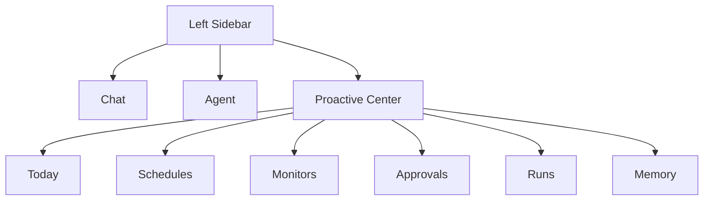
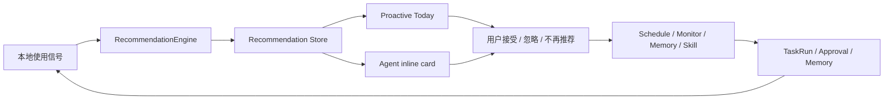
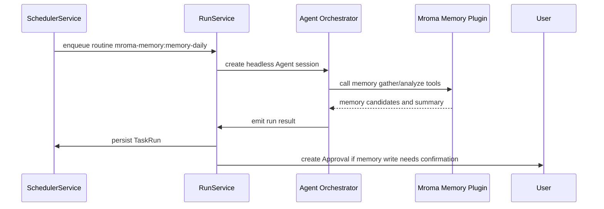

# Mroma Proactive Center 设计文档

> 版本：Draft 2  
> 日期：2026-05-25  
> 范围：Mroma OSS Electron app 的主动协作、定时任务、Monitor、Memory 插件化、Agent Runtime 上下文管理与 UI 设计

## 1. 背景

Mroma 现在已经具备 Agent 会话、工作区 Skills/MCP、本地 JSON/JSONL 会话持久化、Quick Task、后台 Agent 执行、记忆工具、飞书通知等底座。下一步的关键不是简单加一个 Cron 配置页，而是把 Mroma 从“用户发起一次对话”推进到“用户可以委托 Mroma 长期关注、定期整理、持续跟进”的主动协作系统。

这份设计把三个来源合并成一个产品方向：

- Claude Agent SDK / Claude Code 的内置能力：`CronCreate` / `CronList` / `CronDelete`、`Monitor`、Desktop scheduled tasks、Routines、Hooks、custom MCP tools。
- Mroma 当前 Agent Runtime 的多后端现状：Claude Agent SDK 与 Codex SDK 已通过统一 adapter/orchestrator 接入，但 Codex SDK 只提供 turn usage，没有原生 compact API 或 compact event。
- Mroma 早期 proactive 设计探索：Proactive Jobs、Silent Watchdog、Persistent Goal、Session Recall、Skill Curator、Event Hooks。
- 外置实验插件 [Mroma_Proactive](https://github.com/SheldonLiu0412/Mroma_Proactive)：`memory-init`、`memory-daily`、`memory-search`、`memory-edit`、`memory-runner.mjs`、本地 `.memory/` 数据结构。

核心判断：

Claude 内置 Cron/Monitor 可以兼容和展示，但不应成为 Mroma 的长期调度核心。Mroma 需要自己的 durable Scheduler/Monitor，并把 `Mroma_Proactive` 产品化为第一个官方级 proactive plugin/routine 样板。

同样，Proactive run 不能假设所有后端都具备 Claude 原生上下文管理能力。长期、定时、后台执行尤其容易触发上下文膨胀，因此 Scheduler/RunService 必须使用 Mroma 语义化 Agent Runtime：统一读取上下文用量、触发 `compactContext`、记录 `compact_boundary` / `compact_failed`，并在 Codex 后端通过 Mroma 托管式摘要重建新 thread。

## 2. 产品目标

### 2.1 用户价值

Mroma 应该让用户感知到：

1. Mroma 可以记住长期偏好和纠正。
2. Mroma 可以定期整理日常对话和工作上下文。
3. Mroma 可以在任务、发布、CI、文件变化、会话状态变化时主动跟进。
4. Mroma 会解释为什么推荐某个主动功能，并让用户确认、调整、撤销。
5. Mroma 的主动能力是可审计、可暂停、可限制权限的，不是黑盒自动化。

### 2.2 工程目标

1. 建立 Mroma 自己的 durable scheduler，而不是依赖 Claude session-scoped Cron。
2. 建立统一的 proactive run 模型：所有 schedule、monitor、manual run 都产出可追踪的 `TaskRun`。
3. 支持 plugin/routine 声明，让 `Mroma_Proactive` 这类外置能力可被 Mroma 安装、配置、调度、审计。
4. 用 in-process MCP tools 暴露 Mroma 的 Scheduler/Monitor/Memory 能力给 Agent。
5. 将主动推荐做成产品级 UI，而不是靠 prompt 或隐藏设置。
6. 建立 provider-agnostic Agent runtime 策略：Proactive run 不直接依赖 Claude/Codex 细节，而是统一使用 context usage、auto compact、compact boundary、compact failure 等语义事件。

### 2.3 非目标

第一阶段不做：

- 通用复杂 Cron 表达式编辑器。
- 云端 always-on agent。
- 无需用户授权的自动写文件、自动执行 Bash、自动发消息。
- 完整插件市场。
- 跨设备常驻执行。

## 3. 设计原则

### 3.1 Natural language first

用户不应该首先看到 Cron 表单。主入口应该是自然语言：

- “每天晚上帮我整理今天的会话。”
- “下周一提醒我继续这个任务。”
- “帮我盯一下这个 release 状态。”
- “如果 CI 失败，帮我分析原因。”
- “以后遇到我纠正你的地方，帮我整理成 correction。”

Mroma 把自然语言转成可确认的 schedule / monitor / routine。

### 3.2 Visible automation

主动任务必须可见：

- 为什么创建。
- 什么时候运行。
- 会读取什么。
- 会修改什么。
- 上次结果是什么。
- 失败原因是什么。
- 如何暂停、删除、调整。

### 3.3 Least agency

默认只读。写入、执行命令、联网、通知外部系统都需要明确权限边界。

### 3.4 Approval before durable behavior

创建长期任务本身就是一个持久副作用。任何 `ScheduleCreate`、`MonitorCreate`、memory write、Skill update 都必须有用户确认或已保存的授权策略。

### 3.5 Local-first and auditable

Mroma 继续沿用本地 JSON/JSONL 风格。调度配置、运行记录、审批记录都应可导出、可迁移、可审计。

## 4. 概念模型

### 4.1 Schedule

定时运行一个 Agent workflow。

示例：

- 每天 23:30 运行 `memory-daily`。
- 每周五 18:00 做项目周回顾。
- 每天早上整理今天的待办和未完成 Agent 会话。

### 4.2 Monitor

监听某个条件，触发一次 Agent workflow。

示例：

- CI 失败时分析日志。
- Release tag 出现时检查发布状态。
- 某个文件夹变化后总结变更。
- 某个 WIP 会话超过 24 小时未更新时提醒。

### 4.3 Routine

可复用的工作流模板。Routine 可以由 Mroma 内置，也可以由插件提供。

示例：

- `mroma-memory:memory-daily`
- `mroma-memory:memory-init`
- `mroma-memory:weekly-review`
- `mroma-release:release-monitor`
- `mroma-workspace:stale-wip-review`

### 4.4 TaskRun

一次实际运行记录。无论来自 schedule、monitor、手动运行还是 Agent 创建，都统一记录为 `TaskRun`。

### 4.5 Approval

主动任务需要用户确认的动作。

示例：

- 写入长期记忆。
- 删除/修改 memory correction。
- 从 SOP candidate 生成 Skill。
- 执行 Bash。
- 创建长期 schedule/monitor。

### 4.6 Recommendation

Mroma 根据上下文给用户的主动建议，但还不是已创建任务。

示例：

- “你最近连续三天让我总结当天工作，建议开启每日记忆整理。”
- “这个 release 状态你查了多次，建议创建 monitor。”
- “这条纠正可以写入长期记忆。”

## 5. 信息架构

新增一级工作台：`Proactive Center`。

建议它作为左侧 Sidebar rail 的新模式入口，与当前 Chat / Agent 模式并列，不放在 Settings 内。当前 Scratch Pad 是固定 TabBar tab，不是左侧 Sidebar 入口，因此 Proactive 不应按 Scratch 的方式注入为固定 tab。Settings 只负责安全和默认策略。



### 5.1 Today

默认打开的首页。回答三个问题：

1. Mroma 今天主动做了什么？
2. Mroma 建议我开启什么？
3. 有哪些事项需要我确认？

模块：

- `Recommended`：推荐开启的 schedule / monitor / memory action。
- `Active`：正在运行或已启用的主动任务。
- `Needs approval`：等待确认的 memory / skill / file / command 操作。
- `Recent runs`：最近运行记录。
- `Insights`：今日提取的偏好、correction、SOP 候选、未完成任务。

### 5.2 Schedules

定时任务列表。

字段：

- 名称
- Routine
- Workspace
- 下一次运行时间
- 上次运行状态
- 权限档案
- 开关
- 手动运行
- 编辑
- 删除

### 5.3 Monitors

监听任务列表。

字段：

- 名称
- Trigger 类型：`command` / `file` / `session` / `webhook` / `github` / `custom`
- 最近事件
- 最近运行
- 状态
- 开关
- 查看事件
- 编辑
- 删除

### 5.4 Approvals

所有等待用户确认的主动变更。

每个审批卡需要展示：

- 来源：哪个 schedule/monitor/routine/run 产生。
- 建议动作。
- 影响范围。
- diff 或结构化摘要。
- 可选操作：`Approve` / `Edit` / `Reject` / `Snooze`。

### 5.5 Runs

运行历史。

字段：

- run id
- 来源：schedule / monitor / manual / agent
- 状态：queued / running / success / failed / cancelled / waiting_approval
- 开始/结束时间
- 耗时
- cost
- session link
- 输出摘要
- 错误信息

### 5.6 Memory

Mroma Memory 的可视化入口。第一阶段可以只展示摘要和文件入口，后续再做完整管理 UI。

模块：

- Profile summary
- Active corrections
- SOP candidates
- Memory log
- Diary
- Pending memory changes

## 6. 核心 UI 设计

### 6.1 Proactive Today 首页

页面结构：

```text
Proactive
今天 Mroma 正在关注 3 件事，另有 2 个建议等待确认

[Recommended]
┌ Daily Memory
│ 你最近经常让 Mroma 总结当天工作。建议每天晚上整理当天会话。
│ 权限：读取今天活跃会话；写入 Memory 工作区前需要确认
│ [创建] [调整] [忽略]
└

[Active]
Daily Memory       下一次 23:30     上次成功
Release Monitor    10 分钟前检查    无异常

[Needs Approval]
发现 2 条新的 correction 候选
[查看并确认]

[Recent Runs]
Memory Daily 2026-05-17   成功   新增 3 条记忆，1 个 SOP 候选
```

设计要求：

- 不使用营销式 hero。
- 信息密度适中，偏工具台而非落地页。
- 重点在状态、下一步动作、审批。
- 卡片只用于单个重复条目，不把页面大区块都做成浮动卡片。

### 6.2 推荐卡

推荐卡是用户感知 proactive 的核心。

```text
建议开启：每日记忆整理

为什么推荐：
你最近 4 天里有 3 天要求 Mroma 总结当天工作。

它会做什么：
每天晚上读取当天活跃 Chat/Agent 会话，提取长期偏好、纠正、SOP 候选和工作日志。

权限：
只读会话记录；写入长期记忆前需要你确认。

[创建] [调整时间] [不再建议]
```

推荐卡必须有：

- `为什么推荐`
- `会做什么`
- `权限`
- `创建 / 调整 / 忽略`
- `不再建议` 或 `降低推荐频率`

### 6.3 创建确认卡

当用户通过自然语言创建 schedule/monitor 时，Mroma 不直接创建，而是先展示确认卡。

```text
创建定时任务

名称：每日记忆整理
时间：每天 23:30
Routine：mroma-memory:memory-daily
Workspace：Memory

会读取：
- 今天活跃的 Chat 会话
- 今天活跃的 Agent 会话
- 工作区 metadata

可能写入：
- .memory/profile.md
- .memory/corrections/active.json
- .memory/sop-candidates/
- .memory/memory_log/YYYY-MM-DD.md
- .memory/diary/YYYY-MM-DD.md

写入策略：
关键记忆变更需要确认。

[创建] [修改] [取消]
```

### 6.4 Agent 会话中的 inline recommendation

推荐不应只在 Proactive Center 出现。Agent 会话中，在上下文合适时显示轻量推荐。

例：用户说“明天继续这个 UI 修补”。

```text
Mroma 可以明天提醒你继续这个任务。
[创建跟进] [不用]
```

例：用户多次查看 release。

```text
Mroma 可以监听这个 release 状态，有变化时提醒你。
[创建 Monitor] [不用]
```

### 6.5 左侧栏状态感知

左侧栏不承载复杂管理，但应显示轻量状态：

- `Scheduled`：会话关联了未来跟进。
- `Watching`：会话关联了 monitor。
- `WIP`：用户标记未完成。
- `Needs approval`：该会话产生了待确认事项。

建议使用小图标 + tooltip，不塞大量文字。

### 6.6 Settings

Settings 只放全局策略：

- 是否启用 Proactive。
- 默认权限：只读 / 需确认写入 / 允许指定写入。
- 是否允许 Bash-based Monitor。
- 每日最大运行次数。
- 单次最大 turns。
- 单次最大 cost。
- 最大并发。
- 失败通知策略。
- 飞书/桌面通知开关。
- 数据保留策略。

## 7. 用户主动推荐机制

Mroma 应在明确有价值时推荐，不应频繁打扰。

### 7.1 推荐信号

#### 重复行为

信号：

- 用户连续多天要求总结当天工作。
- 用户多次要求做同类 release/CI/PR 检查。
- 用户反复要求整理 Todo 或 WIP。

推荐：

- Daily Memory
- Weekly Review
- Release Monitor
- Today Planning

#### 时间表达

信号：

- “明天继续”
- “稍后提醒我”
- “每天”
- “每周”
- “定期”
- “以后遇到这种情况”

推荐：

- Create follow-up
- Create schedule
- Create routine

#### 外部状态追踪

信号：

- 用户多次查询 GitHub Actions、release、tag、部署状态。
- Agent 输出中出现持续等待状态。

推荐：

- Create monitor

#### 纠正和偏好

信号：

- “以后不要...”
- “下次记得...”
- “我更喜欢...”
- “这个不是我要的...”

推荐：

- Remember correction
- Update profile

#### SOP 候选

信号：

- 同类操作重复出现。
- Agent 多次执行相似步骤。
- 用户明确说“这个流程以后复用”。

推荐：

- Create SOP candidate
- Convert to Skill

### 7.2 推荐策略

推荐服务输出 `Recommendation`，但不直接创建任务。

评分维度：

- `explicitness`：用户是否明确提到时间、监听、记住。
- `frequency`：重复次数。
- `recency`：最近是否频繁发生。
- `confidence`：分类置信度。
- `safety`：是否只读。
- `userPreference`：用户是否曾忽略类似建议。

推荐展示阈值：

- 高置信 + 低风险：可 inline 展示。
- 中置信：只出现在 Proactive Today。
- 高风险：不主动推荐创建，只能在用户明确要求时显示确认卡。

### 7.3 降噪机制

每个推荐都支持：

- `忽略一次`
- `不再建议这类`
- `稍后提醒`
- `为什么看到这个`

Mroma 应记录用户反馈，降低重复打扰。

### 7.4 智能推荐引擎运行闭环

“推荐开启”不应是写死的启动卡片，而应该是一个低频、可解释、可撤销的推荐引擎。

推荐引擎不直接创建 Schedule / Monitor / Memory / Skill，而是生成结构化 `Recommendation`，由用户确认后才转成持久主动任务。



#### 信号输入

第一阶段使用本地、可解释信号：

- Proactive `runs`：近期是否频繁出现同类 run、失败、等待审批。
- Proactive `memories`：是否出现 correction、SOP candidate、diary、fact 候选。
- Proactive `approvals`：是否积压多个待确认动作。
- 已存在的 `schedules` / `monitors`：用于去重，避免重复推荐。
- 用户反馈过的 `recommendations`：保留 accepted / dismissed，不反复打扰。

第二阶段再扩展：

- 最近 Chat / Agent 会话摘要。
- 工具调用和 permission request。
- 用户自然语言里的时间表达、监听表达、长期偏好表达。
- 工作区事件：GitHub、CI、release、文件变更、WIP 会话停滞。

#### 推荐生成

推荐服务输出结构化对象：

```ts
interface Recommendation {
  id: string
  kind: 'schedule' | 'monitor' | 'memory' | 'skill' | 'follow_up'
  title: string
  reason: string
  scope: string
  confidence: number
  safetyLevel: 'read_only' | 'writes_memory' | 'writes_files' | 'runs_commands'
  duplicateKey: string
  evidence: Array<{
    label: string
    detail: string
    sourceId?: string
    sourceKind?: 'run' | 'memory' | 'approval' | 'schedule' | 'monitor'
  }>
  action: RecommendationAction
  status: 'suggested' | 'accepted' | 'dismissed'
  createdAt: number
  updatedAt: number
}
```

推荐必须包含：

- `reason`：一句人能理解的推荐理由。
- `evidence`：可检查的证据，例如“2 条 SOP 候选”、“3 个 release/tag/workflow 信号”。
- `confidence`：用于排序和 UI 强弱表达。
- `duplicateKey`：跨运行稳定去重。
- `safetyLevel`：决定是否能 inline 展示、是否必须进入审批。

#### 去重与反馈

推荐引擎每次运行时：

1. 读取现有 schedules / monitors，已有同类主动任务则不再推荐。
2. 读取现有 recommendations，保留用户的 accepted / dismissed 状态。
3. 用 `duplicateKey` 合并同类推荐，避免每次生成新 ID。
4. 只展示 `status = suggested` 的推荐。
5. 用户忽略后不再因为同一信号立刻重新出现。

#### 第一阶段内置规则

第一阶段先用 deterministic rules，不依赖模型：

- Memory candidates 出现且未开启 `mroma-memory:memory-daily`：推荐 Daily Memory。
- release / tag / workflow / CI 信号达到阈值且未创建 release monitor：推荐 Release Monitor。
- SOP candidates 积累到阈值且未开启 SOP review：推荐 Weekly SOP Review。
- pending approvals 积压到阈值且未开启审批摘要：推荐 Approval Digest。

这些规则只读取本地 JSON，不执行 Agent，不联网，不写入外部系统。

#### 第二阶段 Agent 分析器

当本地规则稳定后，再增加低频 headless Agent analyzer：

- 每天或每 N 次会话后运行一次。
- 输入经过截断和脱敏的 session / memory / run 摘要。
- 输出 `mroma-proactive-recommendations` fenced JSON。
- 主进程只接受 schema 校验通过、权限可解释、duplicateKey 合法的推荐。
- Agent 不能直接创建 Schedule / Monitor，只能提出候选。

这样 Mroma 可以逐步从规则推荐进化到真正的工作模式发现，但控制权仍在本地主进程和用户确认流里。

#### Daily Memory 摄取契约

Daily Memory 不能只依赖 Agent 在 SDK project 目录里写 Markdown 文件。Mroma 主应用需要同时支持两条路径：

1. Agent 最终回答里的结构化 `mroma-memory-items` fenced JSON block。
2. Claude Agent SDK project memory 目录里的 Markdown 文件：`~/.mroma[-dev]/sdk-config/projects/*/memory/*.md`。

结构化 block 是即时摄取路径。每次主动任务运行时，主进程从 assistant messages 中解析：

````markdown
```mroma-memory-items
[
  {
    "title": "Agent model preference",
    "content": "The user wants proactive tasks to use a configurable default model.",
    "kind": "preference",
    "tags": ["agent", "model"]
  }
]
```
````

如果 Agent 或 SDK 额外写入 Markdown 文件，也必须在最终回答中输出同样的 `mroma-memory-items`。这样用户可以立刻在看板中看到候选，不会被“已写入文件但 UI 看不到”的状态卡住。

Markdown 文件是兼容导入路径。Proactive Memory Service 在读取 snapshot 前同步 `sdk-config/projects/*/memory/*.md`：

- 跳过 `MEMORY.md` 索引文件。
- 用文件路径生成稳定 ID，避免重复导入。
- 从 front matter、一级标题和文件名推断 `title`、`kind`、`tags`。
- 作为 `sourceType = sdk_memory_file`、`status = active` 的记忆进入看板。
- 如果用户已经在看板里编辑过该条记忆，且编辑时间晚于文件 mtime，则保留看板编辑。

## 8. Mroma_Proactive 插件化设计

### 8.1 当前插件价值

`Mroma_Proactive` 已经验证：

- 可以从 Mroma 本地 `agent-sessions.json`、`conversations.json` 和 JSONL 中收集会话。
- 可以把记忆整理拆成 Skill workflow。
- 可以维护 `.memory/profile.md`、corrections、SOP candidates、memory_log、diary。
- 可以通过 runner 创建 Mroma session 并使用 Claude Agent SDK 跑 `memory-daily`。

### 8.2 需要调整的边界

当前 `memory-runner.mjs` 直接做了几件主应用应该做的事：

- 注册 Mroma session。
- 写入 Mroma JSONL。
- 调用 Claude Agent SDK。
- 使用 `bypassPermissions`。
- 自己实现 retry/resume。

产品化后这些应迁移到 Mroma 主进程：

- Session 创建和 JSONL 写入由 Mroma `RunService` 负责。
- SDK 调用由现有 `runAgentHeadless()` / orchestrator 负责。
- 权限由 Mroma permission profile 负责。
- retry/resume 由 `SchedulerService` / `RunService` 负责。

插件只保留：

- Skills。
- Scripts。
- Routine manifest。
- Memory schema。
- Data migration。

### 8.3 插件 manifest 草案

```json
{
  "id": "mroma-memory",
  "name": "Mroma Memory",
  "version": "0.1.0",
  "description": "Long-term memory and proactive reflection routines for Mroma.",
  "skills": [
    {
      "slug": "memory-daily",
      "path": "skills/memory-daily/SKILL.md"
    },
    {
      "slug": "memory-init",
      "path": "skills/memory-init/SKILL.md"
    },
    {
      "slug": "memory-search",
      "path": "skills/memory-search/SKILL.md"
    },
    {
      "slug": "memory-edit",
      "path": "skills/memory-edit/SKILL.md"
    }
  ],
  "routines": [
    {
      "id": "memory-daily",
      "title": "Daily Memory",
      "promptTemplate": "Run memory-daily for {{date}}.",
      "defaultSchedule": {
        "type": "daily",
        "time": "23:30"
      },
      "permissionProfile": "memory-daily-default"
    }
  ],
  "tools": [
    {
      "name": "memory_search",
      "kind": "mcp",
      "readOnly": true
    },
    {
      "name": "memory_propose_edit",
      "kind": "mcp",
      "requiresApproval": true
    }
  ],
  "data": {
    "root": "plugins/mroma-memory/data",
    "schemaVersion": 1
  }
}
```

### 8.4 Memory Daily 运行流



## 9. 技术架构

### 9.1 主进程服务

#### SchedulerService

职责：

- 加载 schedule 配置。
- 计算 `nextRunAt`。
- App 启动时恢复状态。
- 到点 enqueue `TaskRun`。
- 管理 missed run 策略。
- 管理并发和重试。

#### MonitorService

职责：

- 管理 monitor trigger。
- 支持 file/session/command/webhook/custom event。
- 把事件转成 `TaskRun`。
- 做 debounce、rate limit、dedupe。

#### ProactiveRunService

职责：

- 创建 Agent session。
- 调用 `runAgentHeadless()`。
- 捕获完成、错误、cost、turns。
- 链接 `TaskRun` 和 Mroma session。
- 订阅 Agent Runtime 的 context usage / compact 语义事件，并写回 `TaskRun`。
- 在长任务或后台任务继续执行前，按策略触发 `compactContext`，避免长期 run 因上下文膨胀失败。

#### AgentRuntimeContextManager

职责：

- 统一处理 Claude / Codex 等后端的上下文用量语义。
- 对 Codex 使用 `AgentContextUsage.source = estimated`，不把 turn usage 伪装成 SDK 精确窗口值。
- 根据模型高级配置中的 `contextTokenLimit` 和 `autoCompactThresholdPercent` 判断是否需要压缩。
- 调用语义化 `compactContext`，而不是把 `/compact` 当普通用户消息发送。
- 记录 `compact_boundary`、`compact_failed`、触发原因、旧 `sdkSessionId`、摘要和错误信息。
- 在 Codex 后端执行 Mroma 托管式压缩：生成摘要、清空旧 `sdkSessionId`、下一轮用摘要启动新 thread。
- 压缩失败时保留旧 thread 可用，并把失败卡片和重试入口展示给用户。

#### PluginRuntime

职责：

- 安装/卸载插件。
- 加载 plugin manifest。
- 同步 Skills 到工作区。
- 注册 plugin-provided routines/tools。
- 管理插件数据目录。

#### RecommendationService

职责：

- 从会话、工具调用、任务状态、用户反馈中提取推荐信号。
- 生成 `Recommendation`。
- 控制展示频率。

#### ApprovalService

职责：

- 创建审批请求。
- 保存用户决定。
- 对 approved action 执行提交。
- 提供审计记录。

### 9.2 数据模型

#### ScheduledTask

```ts
interface ScheduledTask {
  id: string
  title: string
  routineId: string
  pluginId?: string
  workspaceId?: string
  workspaceSlug?: string
  prompt: string
  schedule: ScheduleSpec
  timezone: string
  enabled: boolean
  permissionProfileId: string
  nextRunAt?: number
  lastRunAt?: number
  createdAt: number
  updatedAt: number
  createdBy: 'user' | 'agent' | 'plugin'
}
```

#### Monitor

```ts
interface Monitor {
  id: string
  title: string
  routineId: string
  pluginId?: string
  trigger: MonitorTrigger
  enabled: boolean
  permissionProfileId: string
  debounceMs?: number
  lastEventAt?: number
  lastRunAt?: number
  createdAt: number
  updatedAt: number
}
```

#### TaskRun

```ts
interface TaskRun {
  id: string
  sourceType: 'schedule' | 'monitor' | 'manual' | 'agent'
  sourceId?: string
  routineId?: string
  pluginId?: string
  status: 'queued' | 'running' | 'success' | 'failed' | 'cancelled' | 'waiting_approval'
  trigger: 'scheduled' | 'external_event' | 'manual' | 'recommendation'
  startedAt?: number
  endedAt?: number
  mromaSessionId?: string
  sdkSessionId?: string
  outputSummary?: string
  error?: string
  totalCostUsd?: number
  numTurns?: number
  contextUsage?: {
    backend: 'claude' | 'codex'
    source: 'sdk' | 'estimated' | 'configured' | 'fallback'
    scope: 'turn' | 'active_context' | 'session'
    inputTokens: number
    cachedInputTokens?: number
    outputTokens?: number
    reasoningTokens?: number
    estimatedActiveTokens?: number
    contextWindow?: number
    usedPercent?: number
    updatedAt: number
  }
  compactEvents?: Array<{
    type: 'started' | 'completed' | 'failed'
    reason: 'manual' | 'auto' | 'prompt_too_long'
    backend: 'claude' | 'codex'
    oldSdkSessionId?: string
    newSdkSessionId?: string
    summary?: string
    error?: string
    createdAt: number
  }>
}
```

#### ApprovalRequest

```ts
interface ApprovalRequest {
  id: string
  runId?: string
  sourceType: 'memory' | 'skill' | 'file' | 'command' | 'schedule' | 'monitor'
  title: string
  summary: string
  proposedChange: unknown
  status: 'pending' | 'approved' | 'rejected' | 'edited'
  createdAt: number
  resolvedAt?: number
}
```

#### Recommendation

```ts
interface Recommendation {
  id: string
  type: 'schedule' | 'monitor' | 'memory' | 'skill' | 'follow_up'
  title: string
  reason: string
  confidence: number
  safetyLevel: 'read_only' | 'writes_memory' | 'writes_files' | 'runs_commands'
  proposedAction: unknown
  sourceSessionId?: string
  createdAt: number
  dismissedAt?: number
}
```

### 9.3 存储布局

建议继续本地优先：

```text
~/.mroma/
  proactive/
    schedules.json
    monitors.json
    recommendations.json
    approvals.json
    runs/
      {runId}.json
      {runId}.jsonl
    plugins/
      mroma-memory/
        manifest.json
        data/
          profile.md
          corrections/
          sop-candidates/
          memory_log/
          diary/
```

## 10. Agent Runtime 与 SDK 集成策略

Proactive Center 面向长期任务，必须把 Agent 后端差异收敛到 Mroma 自己的 runtime 语义上，而不是直接暴露某个 SDK 的行为。Claude 与 Codex 都可以驱动 proactive run，但 RunService、SchedulerService、MonitorService 只依赖统一的 Mroma 事件和持久化字段。

### 10.1 统一上下文用量语义

所有 proactive run 都应记录 `AgentContextUsage`：

- `backend`：`claude` / `codex`。
- `source`：`sdk` / `estimated` / `configured` / `fallback`。
- `scope`：`turn` / `active_context` / `session`。
- `inputTokens`、`cachedInputTokens`、`outputTokens`、`reasoningTokens`。
- `estimatedActiveTokens`、`contextWindow`、`usedPercent`。

后端差异：

- Claude：可以优先使用 SDK / modelUsage 的上下文窗口与用量信息。
- Codex：当前只提供 turn-level `input_tokens`、`cached_input_tokens`、`output_tokens`、`reasoning_output_tokens`，因此 `source = estimated`，`scope = turn`，并避免把 cached tokens 二次累加。

UI 要明确展示数据来源：Codex 的百分比和自动压缩阈值是 Mroma 估算，不是 SDK 精确 remaining context。

### 10.2 语义化 compact 协议

Proactive run 不应通过发送普通用户消息 `/compact` 来压缩上下文，而应调用语义化入口：

```ts
interface AgentCompactInput extends Omit<AgentSendInput, 'userMessage'> {
  reason?: 'manual' | 'auto' | 'prompt_too_long'
  mode?: 'managed' | 'fallback_prompt'
}
```

运行结果通过 SDK system message 持久化：

- `subtype = 'compacting'`：临时流式状态，不写入长期 JSONL。
- `subtype = 'compact_boundary'`：压缩成功边界，包含摘要、触发原因、旧 `sdkSessionId`、完成时间。
- `subtype = 'compact_failed'`：压缩失败边界，包含错误信息、触发原因、旧 `sdkSessionId`、失败时间。

UI 要展示：

- `compact_boundary` 摘要卡片：说明“摘要已接入后续上下文”，完整历史仍保留在 UI / JSONL 中。
- `compact_failed` 失败卡片：说明旧 thread 未被重置、原上下文仍可继续使用，并提供重新压缩入口。

### 10.3 Codex 托管式 compact

Codex SDK 当前没有 compact API / compact event。Mroma 对 Codex 使用托管式压缩：

1. 从 Mroma JSONL 中读取当前会话历史。
2. 过滤 transient 流式消息和已压缩边界之前的消息。
3. 构建 deterministic transcript summary；后续可以升级为可选 LLM summary。
4. 写入 `compact_boundary`，记录 summary、reason、old sdk session id。
5. 清空当前会话的 Codex `sdkSessionId`。
6. 下一轮发送时启动新的 Codex thread，并通过 `<managed_compact_summary>` 注入摘要。
7. 如果失败，写入 `compact_failed`，保留旧 `sdkSessionId`，不破坏继续对话能力。

这让 Daily Memory、Weekly Review、Release Monitor 等长期 run 可以在 Codex 后端上持续运行，而不会假设 Codex 具备 Claude 原生上下文压缩。

### 10.4 Proactive run 的自动压缩策略

自动压缩只应在 turn 完成后判断，不能在流式输出中途触发。

建议条件：

- schedule / monitor / routine 启用了 auto compact。
- 已知有效 `contextWindow`。
- `estimatedActiveTokens` 或 `inputTokens` 超过阈值。
- 当前 session 没有 `compactInFlight`。
- 最近一次相同 token/window 状态没有刚触发过压缩。
- 当前 run 未失败、未被用户中止。

默认阈值建议保守，例如 85%。Codex 场景 UI 必须显示“估算”。

### 10.5 内置 Cron

Claude 内置 `CronCreate` / `CronList` / `CronDelete` 应支持 UI 展示和结果渲染，但仅作为 SDK runtime 能力兼容。

Mroma 不应把它作为 durable scheduler 的主实现，因为它是 session-scoped。

策略：

- UI 识别并展示 Cron 工具调用。
- `CronList` 可视为低风险只读。
- `CronCreate` / `CronDelete` 需要用户确认。
- 在 Mroma UI 中提示它是 session-scoped，不等价于 Mroma durable schedule。

### 10.6 内置 Monitor

Claude 内置 `Monitor` 可用于短期命令观察。

策略：

- UI 增加 `Monitor` 图标、显示名和输入摘要。
- 默认需要用户确认。
- 如果全局设置禁用了 nonessential traffic 或相关环境导致不可用，UI 显示原因。
- 长期 monitor 仍使用 Mroma `MonitorService`。

### 10.7 Mroma MCP Tools

Mroma 应通过 `createSdkMcpServer` 暴露自身能力。

建议工具：

```text
mroma_scheduler.create_schedule
mroma_scheduler.list_schedules
mroma_scheduler.update_schedule
mroma_scheduler.delete_schedule
mroma_scheduler.run_now

mroma_monitor.create_monitor
mroma_monitor.list_monitors
mroma_monitor.update_monitor
mroma_monitor.delete_monitor

mroma_memory.search
mroma_memory.propose_edit
mroma_memory.list_pending_changes
```

只读工具设置 `readOnlyHint: true`。创建、删除、写入类工具走审批。

## 11. 权限与安全

### 11.1 Permission Profile

每个 schedule/monitor 绑定权限档案。

示例：

```ts
interface PermissionProfile {
  id: string
  name: string
  allowedTools: string[]
  allowBash: boolean
  allowWriteFiles: boolean
  allowNetwork: boolean
  requireApprovalForMemoryWrite: boolean
  requireApprovalForSkillWrite: boolean
  maxTurns: number
  maxCostUsd: number
  maxRuntimeMs: number
}
```

默认 profile：

- `read-only-review`
- `memory-daily-default`
- `release-monitor-readonly`
- `manual-approved-agent`

### 11.2 风险控制

必须支持：

- 全局关闭 Proactive。
- 单 workspace 关闭 Proactive。
- 单 schedule/monitor 暂停。
- 每日最大运行次数。
- 单次最大 turns/cost。
- 并发限制。
- 审计日志。
- 用户可撤销长期任务。

### 11.3 Memory 安全

主动记忆尤其需要防止：

- 用户临时情绪被永久写入。
- Agent 自己生成的错误推断被写入 profile。
- 对话中的恶意内容污染 SOP/Skill。
- 过时偏好长期残留。

策略：

- `memory-daily` 生成候选，不直接写入关键 profile。
- correction 写入需要确认，或至少在 Daily report 中可撤销。
- 每周 review 清理过时/低置信记忆。
- Memory edit 必须有 diff 和来源。

## 12. 关键用户流程

### 12.1 开启每日记忆整理

1. 用户多次让 Mroma 总结当天工作。
2. RecommendationService 生成 `Daily Memory` 推荐。
3. Proactive Today 和 Agent inline card 展示推荐。
4. 用户点击创建。
5. Mroma 展示确认卡：时间、读取范围、写入范围、审批策略。
6. 用户确认。
7. SchedulerService 创建 schedule。
8. 到点运行 `mroma-memory:memory-daily`。
9. 运行完成后生成 summary、pending approvals 和 `mroma-memory-items`。
10. Proactive Memory Service 同步 SDK memory Markdown 文件，并把可编辑记忆显示在 Memory 看板。

### 12.2 创建 Release Monitor

1. 用户多次查询 release tag / GitHub Actions。
2. Mroma 推荐创建 monitor。
3. 用户确认监听对象和通知策略。
4. MonitorService 定期检查或接收 webhook。
5. 状态变化时创建 TaskRun。
6. Agent 分析变化并输出结果。
7. 结果关联到原会话和 Proactive Runs。

### 12.3 跟进 WIP 会话

1. 用户在 Agent 会话里说“明天继续”。
2. Mroma inline 推荐创建 follow-up。
3. 用户确认时间。
4. 到点后 Mroma 在 Today 显示提醒，也可以新建/恢复 Agent session。

### 12.4 Correction 写入长期记忆

1. 用户纠正 Agent：“以后不要把 release 和商业仓库混淆。”
2. Mroma 推荐 `Remember this correction`。
3. 用户确认。
4. ApprovalService 写入 memory correction。
5. 之后相关上下文可由 memory-search 或自动 memory load 使用。

## 13. BDD 验收用例

### 13.1 UI 推荐

```gherkin
Feature: Proactive recommendations

Scenario: Recommend daily memory after repeated summaries
  Given the user asked Mroma to summarize daily work on three recent days
  When the user opens Proactive Today
  Then Mroma shows a Daily Memory recommendation
  And the card explains why it was recommended
  And the card shows read/write permission scope

Scenario: Dismiss a recommendation
  Given a Daily Memory recommendation is visible
  When the user clicks "不再建议"
  Then Mroma hides the recommendation
  And future similar recommendations are suppressed
```

### 13.2 Schedule 创建

```gherkin
Feature: Schedule creation

Scenario: Create a schedule from natural language
  Given the user says "每天晚上帮我整理当天对话"
  When Mroma parses the request
  Then Mroma shows a schedule confirmation card
  And no schedule is created before confirmation

Scenario: Persist schedule across app restart
  Given the user created a Daily Memory schedule
  When Mroma restarts
  Then SchedulerService restores the schedule
  And nextRunAt is recalculated in the user's timezone
```

### 13.2.1 Daily Memory 摄取

```gherkin
Feature: Daily Memory ingestion

Scenario: Import SDK memory markdown into the Memory board
  Given Daily Memory wrote "agent-model-preference.md" under an SDK project memory directory
  And the SDK memory directory also contains "MEMORY.md"
  When the user opens the Proactive Memory board
  Then Mroma imports "agent-model-preference.md" as an active memory
  And Mroma marks the memory source as "SDK Memory"
  And Mroma does not import "MEMORY.md" as a memory item

Scenario: Require structured memory items from Daily Memory output
  Given a proactive Daily Memory run found long-term memory candidates
  When the Agent returns the final answer
  Then the answer includes a "mroma-memory-items" fenced JSON block
  And Mroma parses the block into editable candidate memories
```

### 13.3 Monitor 创建

```gherkin
Feature: Monitor creation

Scenario: Recommend a release monitor
  Given the user checked the same release status multiple times
  When Mroma detects repeated external status tracking
  Then Mroma recommends creating a monitor

Scenario: Trigger a monitor run
  Given a release monitor is enabled
  When the release status changes
  Then MonitorService creates a TaskRun
  And the run is linked to the source monitor
```

### 13.4 Memory Daily

```gherkin
Feature: Daily memory routine

Scenario: Run daily memory schedule
  Given Daily Memory is scheduled for 23:30
  And there are active Chat and Agent sessions today
  When the schedule becomes due
  Then Mroma starts a headless Agent run
  And the run uses the mroma-memory:memory-daily routine
  And the run creates a visible TaskRun record

Scenario: Require approval for memory write
  Given memory-daily produced new correction candidates
  When the run completes
  Then Mroma creates ApprovalRequest records
  And memory changes are not committed before approval
```

### 13.5 权限

```gherkin
Feature: Proactive permissions

Scenario: Block command monitor without permission
  Given Bash-based monitors are disabled
  When an Agent tries to create a command monitor
  Then Mroma refuses the creation
  And explains which setting blocks it

Scenario: Stop a runaway proactive run
  Given a TaskRun exceeds its max turns or cost budget
  When RunService detects the limit
  Then the run is cancelled
  And the run history records the budget stop reason
```

### 13.6 Agent Runtime 上下文管理

```gherkin
Feature: Proactive Agent runtime context management

Scenario: Record Codex estimated context usage for a proactive run
  Given a proactive run uses the Codex backend
  When Codex returns turn usage with cached input tokens
  Then Mroma stores TaskRun contextUsage with source "estimated"
  And cached input tokens are not counted twice
  And the UI marks the usage as estimated

Scenario: Auto compact a long proactive Codex run
  Given a proactive Codex run has a configured context window
  And the estimated active context exceeds the auto compact threshold
  When the turn completes successfully
  Then RunService requests semantic compactContext with reason "auto"
  And Mroma persists a compact_boundary with the generated summary
  And the next turn starts a new Codex thread with the managed compact summary injected

Scenario: Keep the original Codex thread usable after compact failure
  Given a proactive Codex run is compacting context
  When managed compaction fails
  Then Mroma persists a compact_failed system message
  And TaskRun records the compact failure in compactEvents
  And the old sdkSessionId remains available for the next turn
  And the UI shows a retryable compact failure card
```

## 14. MVP 分期

### Phase 1: Proactive foundation

范围：

- 新增 `Proactive Center / Today` 基础 UI。
- 新增 `Schedules` 列表和详情。
- 实现 `SchedulerService` skeleton。
- 实现 `TaskRun` 持久化。
- `TaskRun` 记录 `contextUsage` 和 `compactEvents`，为后续长任务上下文管理打底。
- 增加 `Monitor` 工具 UI 映射。
- 兼容展示 Claude 内置 `Cron*` 工具调用。

验收：

- 用户可以创建一个本地 durable schedule。
- App 重启后 schedule 仍存在。
- 到点能创建 run 记录。
- run 记录可以展示最近一次上下文用量来源和压缩事件。

### Phase 2: Mroma Memory plugin MVP

范围：

- 将 `Mroma_Proactive` 改造成 `mroma-memory` 插件。
- 注册 `memory-daily` routine。
- 接入 `memory-daily` schedule。
- Daily run 输出 summary 和 pending approvals。
- Daily run 通过统一 Agent Runtime 执行，Claude / Codex 后端都能记录 context usage。

验收：

- 用户可以开启每日记忆整理。
- 到点生成可见运行记录。
- 记忆变更需要确认。
- Codex 后端在上下文接近阈值时可以走 Mroma 托管式 compact，失败时保留旧 thread 可继续运行。

### Phase 3: Recommendation cards

范围：

- Proactive Today 推荐卡。
- Agent inline recommendation。
- Quick Task recommendation。
- 推荐忽略/不再建议。

验收：

- 重复总结行为触发 Daily Memory 推荐。
- 时间表达触发 follow-up 推荐。
- correction 触发 memory recommendation。

### Phase 4: Monitor MVP

范围：

- `MonitorService`。
- session stale monitor。
- file monitor。
- release/CI monitor 的插件化样板。

验收：

- 状态变化触发 TaskRun。
- Monitor 运行记录可审计。
- 用户可以暂停/删除 monitor。

### Phase 5: Routine ecosystem

范围：

- Routine manifest 标准化。
- 插件安装/卸载 UI。
- Routine marketplace 或导入机制。
- SOP candidate -> Skill 的审批流。

## 15. 成功指标

产品指标：

- 用户主动开启至少一个 schedule 的比例。
- Daily Memory 被保留 7 天以上的比例。
- 推荐卡创建率。
- 推荐卡忽略率。
- Approval 完成率。
- 用户从 Proactive Today 返回历史 run 的频率。

工程指标：

- schedule 重启恢复成功率。
- run 失败率。
- runaway cancellation 次数。
- 平均 run cost。
- memory approval rollback 次数。

体验指标：

- 用户是否理解任务会做什么。
- 用户是否能找到关闭入口。
- 用户是否能看懂为什么推荐。
- 用户是否能从运行历史恢复上下文。

## 16. 待决策问题

1. 一级入口命名：`Proactive`、`自动协作`、`Today`、还是 `Tasks`？
2. `Mroma_Proactive` 是否直接迁入主仓库，还是保持外置但用插件 manifest 安装？
3. Memory 写入默认策略：全部审批，还是低风险日志自动写入、profile/correction 审批？
4. 是否第一阶段支持 webhook monitor？
5. 飞书通知是否作为 Proactive 的默认通知渠道之一？
6. Schedule missed run 默认策略：跳过、补跑一次、还是询问用户？

## 17. 推荐的下一步

建议下一步直接进入 Phase 1 + Phase 2 的设计实现：

1. 先补齐 UI 层的 `Monitor` 工具映射和 Cron/Monitor 展示一致性。
2. 新增 `Proactive Center` 的 Today/Schedules/Runs 静态页面骨架。
3. 实现本地 `SchedulerService` 和 `TaskRun` 存储。
4. 把 `Mroma_Proactive` 的 `memory-daily` 注册为第一个 routine。
5. 为 Daily Memory 创建 BDD 测试和一个端到端 smoke flow。

第一条真正可感知的用户价值应是：

“Mroma 每天帮我整理当天会话，提取需要确认的长期记忆、行为纠正、SOP 候选，并在 Proactive Today 里让我审查。”

这比先做通用 Cron 编辑器更能体现 Mroma 的主动协作能力。

## 18. 参考资料

- Claude Code tools reference: https://code.claude.com/docs/en/tools-reference
- Claude Code scheduled tasks: https://code.claude.com/docs/en/scheduled-tasks
- Claude Desktop scheduled tasks: https://code.claude.com/docs/en/desktop-scheduled-tasks
- Claude Agent SDK custom tools: https://code.claude.com/docs/en/agent-sdk/custom-tools
- Claude Agent SDK hooks: https://code.claude.com/docs/en/agent-sdk/hooks
- Mroma_Proactive: https://github.com/SheldonLiu0412/Mroma_Proactive
